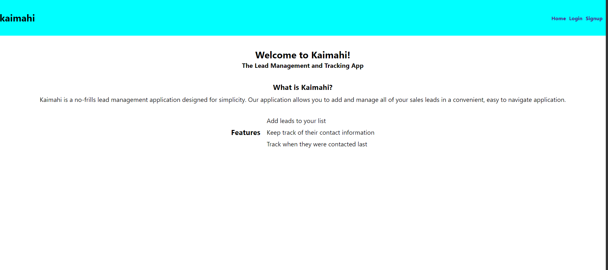

# Welcome to kaimahi

Kaimahi is a full-stack web application that simplifies your lead management and tracking needs. 

The technologies used for this application were: React, PostgreSql, Express, and Node.

# Why use this application?

This application is a simple, no-frills way to orgnize your sales leads. Utilizing minimalistic UI/UX, kaimahi makes referencing your leads and their contact information secure and simple.

# How it works

Upon reaching the homepage at https://kaimahi-client.vercel.app/ you can navigate to the signup page by clicking 'Signup' in the navigation bar at the top right of the page.

 Fill out the form and create your account by hitting the 'Register' button and you'll be redirected to the login page (which can be reached from the homepage if you are already a registerd user). 
 

 
 
 

 Log in with your email and password and you will be redirected to your dashboard, which will show all of your leads in an easy to read table. 

To add leads, simply click the 'Add lead' button and a form will be generated. Fill out the form and click the 'Add/lead' button at the bottom of the form and your new lead will be added to your list!

Should you wish to edit or update your leads' information, simply click the 'edit' button at the end of the row of the corresponding lead you wish to edit.

Want to remove a lead from your list? Simply click the 'Delete' button for your lead and away they go!

Don't forget to log out when you are finished by hitting the 'Logout' button t the top right of the navigation bar!

We wish you all the best of luck with your sales and thank you for using kaimahi!

## Code Repositories

kaimahi-client: https://github.com/jvaughan007/kaimahi-client
kaimahi API server: https://github.com/jvaughan007/kaimahi-server

# Getting Started with Create React App

This project was bootstrapped with [Create React App](https://github.com/facebook/create-react-app).

## Available Scripts

In the project directory, you can run:

### `npm start`

Runs the app in the development mode.\
Open [http://localhost:3000](http://localhost:3000) to view it in the browser.

The page will reload if you make edits.\
You will also see any lint errors in the console.

### `npm test`

Launches the test runner in the interactive watch mode.\
See the section about [running tests](https://facebook.github.io/create-react-app/docs/running-tests) for more information.

### `npm run build`

Builds the app for production to the `build` folder.\
It correctly bundles React in production mode and optimizes the build for the best performance.

The build is minified and the filenames include the hashes.\
Your app is ready to be deployed!

See the section about [deployment](https://facebook.github.io/create-react-app/docs/deployment) for more information.

